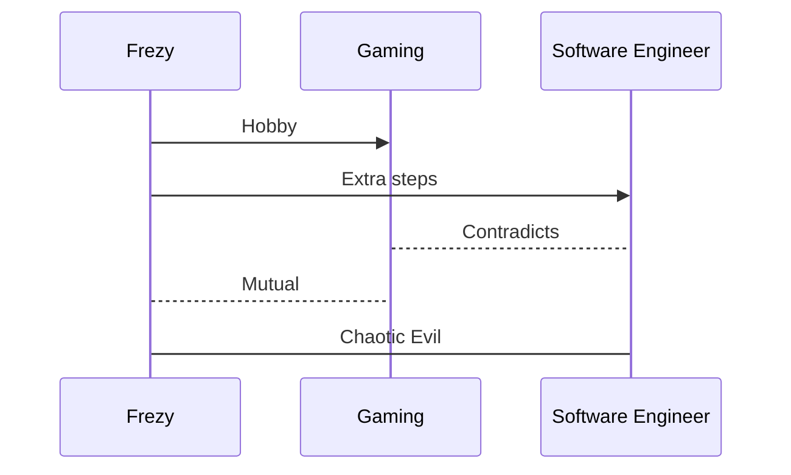

<h2 align=center>
Hello Strangers, I'm Frezy Ananta!
</h2>	

<h3 align=center>
 For short call me Frezy, I'm currently learning and aiming to be an software engineer.
</h3>	

<h3 align=center> Connect with me </h3>

<table align=center>
	<thead>
	<tr>
		<th>

</th>
<th>

</th>
</tr>
</thead>
</table>

 
<h3 align=center>OR</h3>
 

<h3 align=center>Reach Me</h3>
 
<a href="https://mail.google.com/mail/?view=cm&fs=1&to=dvalinnsimulacrum@gmail.com&su=About%20This%20Project&body=Hello!">dvalinnsimulacrum@gmail.com</a>

<h3 align=center>Programming Language (Studied)</h3>

	<table>
	<thead>
	<tr>
	<th>PYTHON</th>
	<th>KOTLIN</th>
	<th>PHP</th>
	<th>JAVASCRIPT</th>
	<th>R</th>
	<th>JAVA</th>
</tr>		
</thead>	
</table>

 
 

<h3 align=center>Database (Studied)</h3>

	<table>
	<thead>
	<tr>
	<th>MYSQL</th>
	<th>MARIADB</th>
	<th>FIREBASE</th>
</tr>		
</thead>	
</table>

